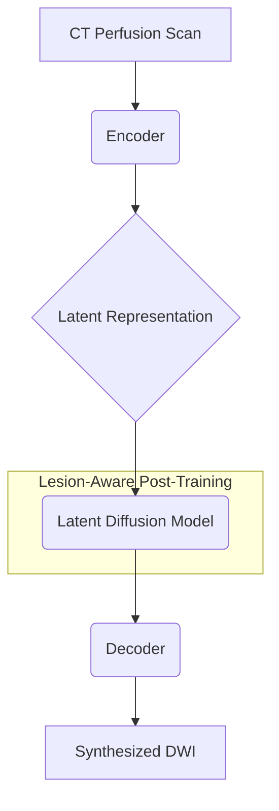

# Lesion-Aware Post-Training of Latent Diffusion Models for Synthesizing Diffusion MRI from CT Perfusion

[](https://miccai.org/en/)
[](./paper.pdf)

**Provisionally accepted at MICCAI 2025 (Top 9% Submission)**

This repository contains the official PyTorch implementation for the paper "Lesion-Aware Post-Training of Latent Diffusion Models for Synthesizing Diffusion MRI from CT Perfusion".

## 📖 Introduction

Acute ischemic stroke is a time-critical emergency where quick and accurate diagnosis is paramount. Diffusion-weighted imaging (DWI) is the gold standard for identifying ischemic legions, but it's not always available. CT Perfusion (CTP) is more common but lacks the specificity of DWI. This work bridges the gap by proposing a novel method to synthesize high-fidelity DWI from CTP scans.

Our approach, which we call **Lesion-Aware Post-Training (LAPT)**, leverages the power of Latent Diffusion Models (LDMs). We first train a standard LDM to synthesize DWI from CTP. Then, we introduce a lesion-aware post-training step that specifically focuses the model on accurately rendering ischemic lesions, which are often subtle and complex. This ensures that our synthesized DWI is not only visually realistic but also clinically reliable.

### Key Contributions
- A novel LAPT framework for high-fidelity and clinically-aware medical image synthesis.
- A method to generate high-quality DWI from CTP, potentially enabling faster stroke diagnosis in settings where DWI is unavailable.
- State-of-the-art performance in synthesizing realistic DWI scans that preserve lesion details.

## ✨ Results

Here are some examples of DWI synthesized from CTP images using our LAPT model.

| CTP Input | Synthesized DWI (Ours) | Ground Truth DWI |
|:---:|:---:|:---:|
| *Image Placeholder* | *Image Placeholder* | *Image Placeholder* |
| *Image Placeholder* | *Image_Placeholder* | *Image Placeholder* |

*(We will add images here soon)*

## 🧬 Model Architecture

Our model builds upon the Latent Diffusion Model architecture. The core innovation is the Lesion-Aware Post-Training stage, where the diffusion model is fine-tuned to better capture the characteristics of stroke lesions.



## 🚀 Getting Started

### Prerequisites

This codebase is built on PyTorch and PyTorch Lightning. We recommend using `conda` to manage dependencies.

First, clone the repository:
```bash
git clone https://github.com/your-username/your-repo-name.git
cd your-repo-name
```

An `environment.yml` file may be available in the parent `CTP2DWI` directory. If so, you can create the conda environment with:

```bash
conda env create -f ../environment.yml
conda activate your-env-name
```

Key dependencies include:
- Python 3.8+
- PyTorch
- PyTorch Lightning
- OmegaConf
- WandB (for logging)
- NumPy, Pillow

### Data Preparation

You will need to prepare your dataset of paired CTP and DWI scans. The data loading is handled by the `DataModuleFromConfig` class in `main.py`, which is configured through a `yaml` file. Please structure your data and create a corresponding `yaml` configuration for `train`, `validation`, and `test` sets.

## 💻 Usage

This project uses `main.py` as the main entry point for training and testing, configured by `.yaml` files.

### Training

To train the model, you need to specify a configuration file. Example configuration files can be found in the `configs/` directory.

```bash
python main.py --base configs/your_training_config.yaml -t --gpus 0,1 --project "LAPT_DWI_Synthesis"
```
- `--base`: Path to the base configuration YAML file.
- `-t` or `--train`: A boolean flag to enable training mode.
- `--gpus`: Specify which GPUs to use.
- `--project`: Name of the project (for logging, e.g., with WandB).

### Inference

To run inference with a trained model, you can use the same `main.py` script. You need to provide a path to the trained checkpoint.

```bash
python main.py --resume path/to/your/log/directory/ --no-test False
```

- `--resume`: Path to the log directory of a trained model. The script will automatically find the `last.ckpt`. Or you can provide the full path to a checkpoint file.
- `--no-test False`: Make sure testing is enabled.

## 📜 Citation

If you find our work useful in your research, please consider citing our paper:

```bibtex
@inproceedings{author2025lapt,
  title={Lesion-Aware Post-Training of Latent Diffusion Models for Synthesizing Diffusion MRI from CT Perfusion},
  author={Your Name and Co-authors},
  booktitle={International Conference on Medical Image Computing and Computer-Assisted Intervention (MICCAI)},
  year={2025},
  organization={Springer}
}
```
*(BibTeX entry will be updated upon publication)*

## 🙏 Acknowledgements

We would like to thank...

## 📄 License

This project is licensed under the [License Name] License - see the `LICENSE.md` file for details. 